# 💊 PillMinder - Documentación del Proyecto

**Nombre del Grupo:** GR1-A

## 👥 Integrantes
* **Jesús Repiso Rio**
* **Máximo Prados Meléndez**
* **Pablo Galvez Castillo**

---

## 📄 Introducción

### Tema y Finalidad de la Aplicación
**PillMinder** es una aplicación nativa para dispositivos Android diseñada con el objetivo principal de facilitar y mejorar la gestión de la toma de medicamentos.

Su finalidad es servir como un recordatorio fiable y un asistente personal para cualquier usuario que siga un tratamiento médico, asegurando que las dosis se administren a las horas correctas y en la cantidad adecuada.

### ¿Qué pretende solucionar/mejorar?
La adherencia a un tratamiento médico es fundamental para su eficacia. Sin embargo, en la vida cotidiana, es común olvidar tomar una pastilla, especialmente cuando se deben administrar varias dosis a lo largo del día o se manejan múltiples medicamentos.

PillMinder pretende solucionar este problema proporcionando una herramienta intuitiva y automatizada que reduce la carga cognitiva del usuario. La aplicación busca:

* **Mejorar la adherencia al tratamiento:** Mediante notificaciones puntuales, se minimiza el riesgo de olvidar una dosis.
* **Simplificar la gestión de medicamentos:** Centraliza toda la información relevante de los medicamentos (nombre, dosis, horarios, stock) en un solo lugar.
* **Aportar tranquilidad:** Tanto a los pacientes como a sus cuidadores, sabiendo que existe un sistema de recordatorio fiable en funcionamiento.

---

## 🚀 Explicación de las Funcionalidades

PillMinder cuenta con un conjunto de funcionalidades orientadas a una gestión completa y sencilla de los tratamientos médicos.

* **Creación y Edición de Medicamentos:** El usuario puede añadir nuevos medicamentos a su lista personal. Para cada uno, es posible especificar nombre, dosis (ej. 1, 2, 500), tipo de dosis ("comprimido", "ml", "gota", etc.) y stock disponible.

* **Gestión Inteligente del Estado de la Toma:**
    * El botón **"TOMAR"** solo se activa durante una ventana de tiempo específica (desde la hora exacta hasta 60 minutos después).
    * Fuera de esta ventana, el botón se desactiva y muestra **"NO ES LA HORA"**.
    * Al marcar una toma, el botón cambia a **"TOMADA"** y muestra la hora de registro, desactivándose permanentemente para esa franja.

* **Programación de Múltiples Tomas:** Para un mismo medicamento, el usuario puede configurar varias alarmas a lo largo del día.

* **Gestión de Horarios Flexible:** Añadir nuevas horas o eliminar una o todas mediante una pulsación larga sobre el campo de horas.

* **Sistema de Alarmas y Notificaciones:** Utiliza el `AlarmManager` de Android para alarmas precisas que se activan incluso con la app cerrada.

* **Persistencia de Datos con Firebase:** La información se almacena en la nube con **Firebase Firestore**, asegurando la sincronización y seguridad de los datos.

* **Soporte Multi-idioma:** Disponible en **Español** e **Inglés**, adaptándose automáticamente al idioma del dispositivo.

---

## ⚙️ Requisitos de Instalación y Configuración

Para la correcta ejecución del proyecto en un entorno local, es necesario configurar la seguridad de Firebase.

### Archivo de Configuración (`google-services.json`)
La conexión con Firestore requiere credenciales de acceso. Por seguridad, el archivo `google-services.json` **no se incluye en el repositorio público**.

Para evaluar o compilar el proyecto, siga estos pasos:
1.  Disponer del archivo `google-services.json` adjunto en la entrega.
2.  Colocarlo manualmente en: `.../pillMinder/app/google-services.json`.
3.  Sincronizar el proyecto con Gradle en Android Studio.

> **Nota Importante:** Si no se incluye este archivo, la aplicación fallará al iniciar.

---

## 📖 Guía de Uso

### 🔐 Registro e Inicio de Sesión
1.  Al abrir la app, verás la pantalla de autenticación.
2.  **Nuevos usuarios:** Introduce correo y contraseña (mín. 6 caracteres) y pulsa **"Registrarse"** o **"Register"**.
3.  **Usuarios existentes:** Introduce credenciales y pulsa **"Iniciar Sesión"** o **"Log In"**.

  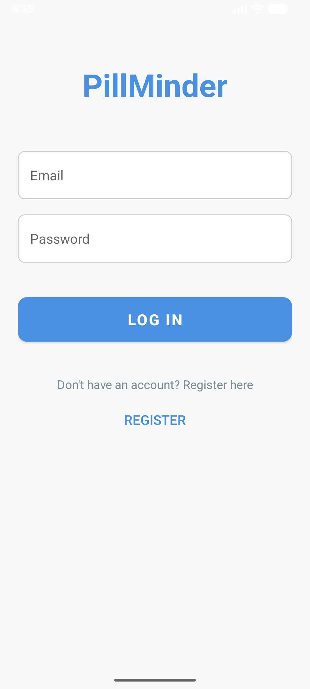

<em>Pantalla de Inicio de Sesión y Registro</em>

### ➕ Añadir un Nuevo Medicamento
1.  En la pantalla principal, pulsa el botón flotante **'+'**.
2.  Rellena el formulario: Nombre, Dosis, Tipo y Stock.
3.  Pulsa sobre **“Hora de la toma”** para abrir el reloj.
4.  Elige hora/minuto y acepta. Repite para más tomas.
5.  Pulsa **“GUARDAR MEDICAMENTO”** o **"SAVE MEDICATION"**.

<table align="center" border="0">
  <tr>
    <td align="center">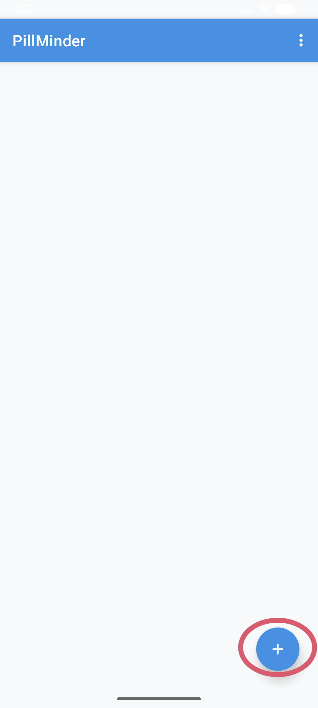</td>
    <td align="center"></td>
  </tr>
  <tr>
    <td align="center"><em>Pantalla Principal con botón (+)</em></td>
    <td align="center"><em>Formulario de Nuevo Medicamento</em></td>
  </tr>
</table>

### ✅ Marcar una Toma de Medicamento
1.  A la hora programada, el botón del medicamento se activará mostrando **"TOMAR"**.
2.  Púlsalo y confirma en el diálogo que aparece.
3.  El stock se reduce y el botón cambia a **"TOMADA"**, mostrando la hora de registro.

<table align="center" border="0">
  <tr>
    <td align="center">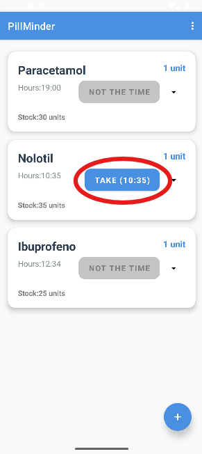</td>
    <td align="center">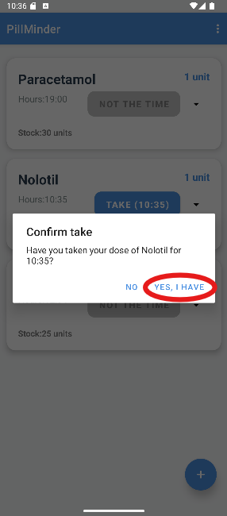</td>
  </tr>
  <tr>
    <td align="center"><em>Botón 'Tomar' activado</em></td>
    <td align="center"><em>Diálogo de confirmación de toma</em></td>
  </tr>
</table>

### ✏️ Editar un Medicamento
1.  Pulsa el menú de opciones (tres puntos) en la tarjeta del medicamento.
2.  Selecciona **"Modificar"** o **"Edit"**.
3.  Modifica cualquier campo (nombre, dosis, stock, horas).
4.  Pulsa **“ACTUALIZAR CAMBIOS”** o **"UPDATE CHANGES"**.

<table align="center" border="0">
  <tr>
    <td align="center">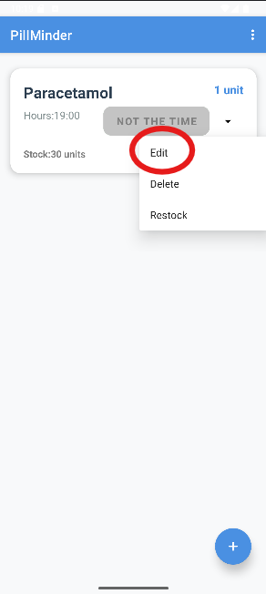</td>
    <td align="center">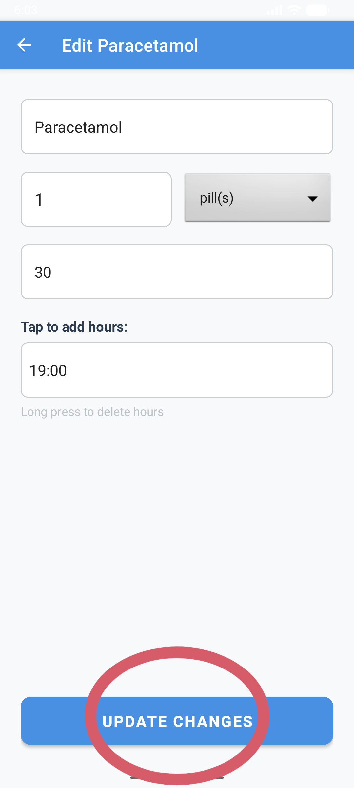</td>
  </tr>
  <tr>
    <td align="center"><em>Opciones de Medicamento (Modificar)</em></td>
    <td align="center"><em>Pantalla de Edición</em></td>
  </tr>
</table>

### 🗑️ Borrar un Medicamento
1.  Pulsa el menú de opciones en la tarjeta del medicamento.
2.  Selecciona **"Borrar"** o **"Delete"**.
3.  Confirma la acción en el diálogo para eliminarlo permanentemente.

<table align="center" border="0">
  <tr>
    <td align="center">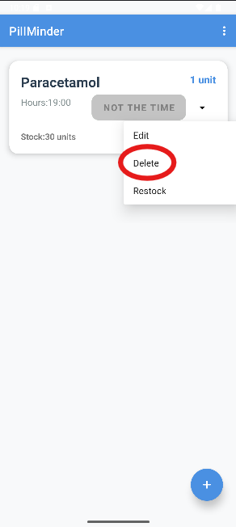</td>
    <td align="center">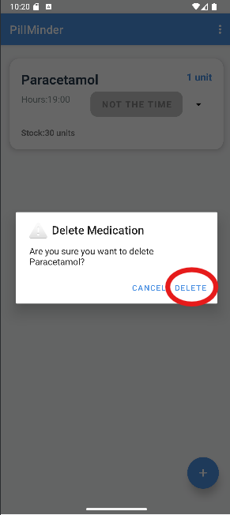</td>
  </tr>
  <tr>
    <td align="center"><em>Opciones de Medicamento (Borrar)</em></td>
    <td align="center"><em>Confirmación de borrar</em></td>
  </tr>
</table>

### 📦 Reponer Stock de un Medicamento
1.  Pulsa el menú de opciones en la tarjeta.
2.  Selecciona **"Reponer"** o **"Restock"**.
3.  Introduce la cantidad a añadir y pulsa **"Añadir"** o **"Add"**.

<table align="center" border="0">
  <tr>
    <td align="center">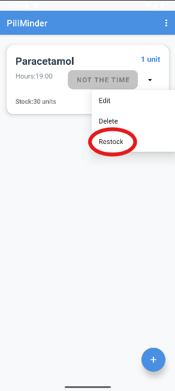</td>
    <td align="center">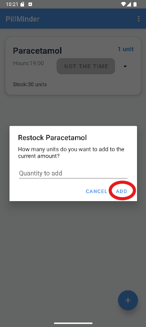</td>
  </tr>
  <tr>
    <td align="center"><em>Opciones de Medicamento (Reponer)</em></td>
    <td align="center"><em>Pantalla de Reponer Stock</em></td>
  </tr>
</table>

### 🚪 Cerrar Sesión
1.  Pulsa el icono de menú (tres puntos) en la esquina superior derecha de la pantalla principal.
2.  Selecciona la opción **"Cerrar Sesión"** o **"Log Out"**.

<table align="center" border="0">
  <tr>
    <td align="center">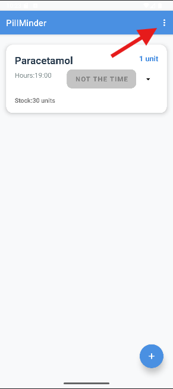</td>
    <td align="center">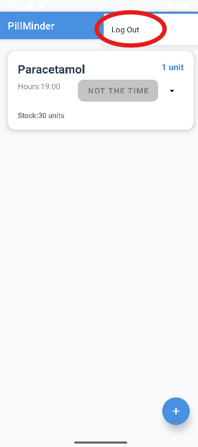</td>
  </tr>
  <tr>
    <td align="center"><em>Menú de opciones superior</em></td>
    <td align="center"><em>Opción Cerrar Sesión</em></td>
  </tr>
</table>

### 🔔 Recibir y Gestionar Notificaciones
1.  Acepta el permiso de notificaciones al instalar la app.
2.  No requieres acción extra. La app funciona en segundo plano.
3.  A la hora programada, recibirás una notificación en tu dispositivo.

---

## 🔗 Repositorio
El código fuente del proyecto se encuentra disponible en:
[https://github.com/j3sus9/pillMinder.git](https://github.com/j3sus9/pillMinder.git)
